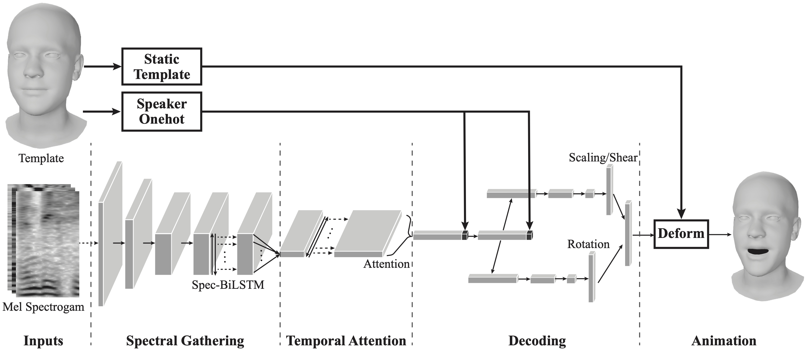

### Supplementary Video


### Citation
```bibtex
@article{chai2022speech,
  title={Speech-driven facial animation with spectral gathering and temporal attention},
  author={Chai, Yujin and Weng, Yanlin and Wang, Lvdi and Zhou, Kun},
  journal={Frontiers of Computer Science},
  volume={16},
  number={3},
  pages={1--10},
  year={2022},
  publisher={Springer}
}
```